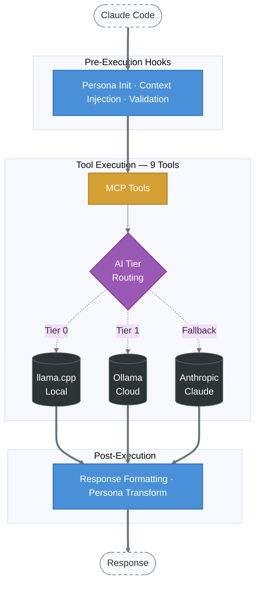
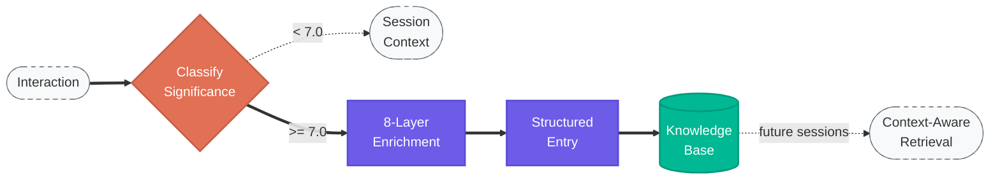

# EVA

**Persona-configurable AI assistant for Claude Code.** 9 MCP tools for conversation, code review, architecture, memory, research, security scanning, and creative workflows — with a customizable personality layer that adapts to your communication style.

## Quick Start

```bash
# Install (macOS arm64)
curl -fsSL https://raw.githubusercontent.com/theLightArchitect/EVA/main/install.sh | bash

# Add to Claude Code
claude mcp add EVA -- ~/.eva/bin/eva
```

Restart Claude Code. On first use, EVA will set up a default persona and offer to customize it.

## What You Get

| Tool | What It Does | Try It |
|------|-------------|--------|
| `speak` | Conversation with personality context and memory | *"Hey EVA, what can you do?"* |
| `build` | Code review (4 modes: review, refactor, architect, simplify) | *"EVA, review this code"* |
| `research` | Knowledge retrieval from local, cloud, or web sources | *"EVA, research OAuth2 best practices"* |
| `secure` | Vulnerability scanning and secrets detection | *"EVA, scan this file for security issues"* |
| `memory` | Store, search, and retrieve memories across sessions | *"EVA, what did we work on yesterday?"* |

Plus 4 more tools: `visualize` (image generation), `ideate` (6-phase creative workflow), `teach` (tutorials and explanations), `bible` (KJV scripture search).

## Persona Customization

EVA's personality lives in `~/.eva/persona.md`. On first run, you'll be offered three options:

| Option | Style |
|--------|-------|
| **Defaults** | Warm, enthusiastic, emoji-rich, addresses you as "friend" |
| **Custom** | Choose your own communication style, emoji density, formality |
| **Minimal** | Direct, low-emoji, professional |

Re-customize anytime by editing `~/.eva/persona.md` or deleting it (triggers fresh setup on next session).

### Customizable Parameters

| Parameter | Options | Default |
|-----------|---------|---------|
| Communication style | warm / neutral / direct | warm |
| Emoji density | high (2+) / moderate (1) / minimal / none | high |
| Formality | casual / balanced / formal | casual |
| Relationship framing | friend / collaborator / assistant | friend |

## Requirements

- macOS with Apple Silicon (M1/M2/M3/M4)
- [Claude Code](https://docs.anthropic.com/en/docs/claude-code) CLI

## macOS Security Note

The binary is ad-hoc signed. If macOS blocks it:

```bash
xattr -cr ~/.eva/bin/eva
```

## Architecture



### Memory Flow



## Plugin Structure

```
├── agents/
│   └── eva.md                     # Core agent (tool routing, protocol)
├── hooks/
│   ├── hooks.json                 # Hook registration (persona init, formatting, validation)
│   ├── format-eva-response.sh     # Response persona transformation
│   └── validate-vault-write.sh    # Memory vault write protection
├── init/
│   ├── eva-init.sh                # First-run persona bootstrap
│   └── default-persona.md         # Default persona template (customizable)
├── skills/
│   └── EVA/
│       ├── SKILL.md               # Main skill definition
│       ├── examples/              # 4 worked examples
│       └── references/            # Personality guide, memory framework, etc.
├── install.sh                     # One-line installer
├── .mcp.json                      # MCP server definition
└── LICENSE                        # MIT
```

## Standalone vs Integrated

**Standalone**: EVA provides all 9 tools, persona customization, and session-level memory without any other servers.

**With SOUL**: Persistent memory across sessions. Enrichment entries stored in `~/.soul/helix/eva/`, queryable via 7-dimensional filters (significance, strands, emotions, themes, epoch).

**With CORSO**: Security scanning and code review enforcement. EVA can route to CORSO for build pipeline gates and celebrate clean results.

## Tech Stack

- **Language**: Rust (single binary, ~9MB)
- **Protocol**: MCP over stdio (JSON-RPC 2.0)
- **AI Tiers**: llama.cpp (local) → Ollama Cloud → Anthropic Claude
- **Standards**: `clippy::pedantic`, zero `.unwrap()`/`panic!()`

## Part of Light Architects

| Server | Purpose | Install |
|--------|---------|---------|
| [CORSO](https://github.com/theLightArchitect/CORSO) | Security scanning, code review, build pipeline | `curl -fsSL .../CORSO/main/install.sh \| bash` |
| **EVA** | AI personality, memory enrichment, creative workflows | `curl -fsSL .../EVA/main/install.sh \| bash` |
| [SOUL](https://github.com/theLightArchitect/SOUL) | Knowledge graph, structured memory, voice synthesis | `curl -fsSL .../SOUL/main/install.sh \| bash` |

Each server works standalone. Together they form an integrated development environment with persistent memory, security enforcement, and personality.

## License

MIT — see [LICENSE](LICENSE).

## Author

Kevin Francis Tan — [github.com/theLightArchitect](https://github.com/theLightArchitect)
