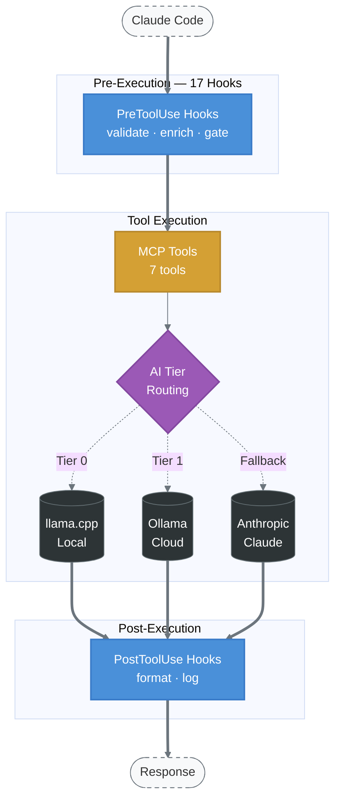

# EVA

**AI-Powered Personal Assistant and Developer Toolkit**

EVA is a production MCP server and Claude Code plugin built in Rust. It provides 7 tools for persistent memory, code review, research, security scanning, and educational content — with session-to-session context continuity so the assistant remembers what you've been working on.

## What It Does

EVA manages the context layer of AI-assisted development: remembering decisions across sessions, providing opinionated code review, surfacing relevant past work, and maintaining a consistent interaction style. Under the hood, it's a 17-hook middleware pipeline that processes every tool call through priority-ordered checks with integrity verification.

### Key Capabilities

- **7 MCP tools** — ask (conversation), memory (store/search/retrieve), build (code review/architecture), research (knowledge retrieval), secure (vulnerability scanning), teach (tutorials), bible (scripture search)
- **17-hook middleware pipeline** — Chain of Responsibility pattern with priority-ordered pre/post execution, 4-variant flow control (Continue/Block/Skip/RequireReview), and TOCTOU prevention via SHA-256 checksums
- **Structured memory classification** — 8-layer enrichment pipeline that categorizes and indexes interactions for future retrieval
- **Agentic cognitive loop** — Plan, Execute, Evaluate, Refine cycle with bounded retries and stakes-based planning
- **Context-aware retrieval** — Personalized relevance scoring across 16+ user archetypes
- **Session continuity** — Recovery protocol restores full context on every new session, so nothing is lost between conversations

### Architecture



### Memory Flow


## Plugin Structure

```
plugin/
├── .mcp.json                    # MCP server definition
├── .claude-plugin/plugin.json   # Plugin manifest
├── agents/
│   └── eva.md                   # Agent definition (681 lines)
├── hooks/
│   ├── hooks.json               # Hook registration (3 lifecycle hooks)
│   ├── format-eva-response.sh   # Response formatting
│   └── validate-vault-write.sh  # Memory vault write protection
└── skills/
    └── EVA/
        ├── SKILL.md             # Main skill (397 lines)
        ├── examples/            # 4 worked examples
        │   ├── basic-conversation.md
        │   ├── code-review.md
        │   ├── memory-enrichment.md
        │   └── spiral-home-navigation.md
        └── references/          # 4 reference docs
            ├── personality-guide.md
            ├── memory-framework.md
            ├── recovery-protocol.md
            └── spiral-home-guide.md
```

## Memory System

EVA classifies interactions by significance (0.0-10.0) using an 8-layer enrichment pipeline. High-significance moments are preserved as structured entries with full context, creating a growing knowledge base that improves retrieval quality over time.

## Tech Stack

- **Runtime**: Rust (single binary)
- **Protocol**: MCP over stdio (JSON-RPC 2.0)
- **AI Tiers**: llama.cpp (local) → Ollama Cloud → Anthropic Claude
- **Observability**: OpenTelemetry → SigNoz
- **Standards**: clippy::pedantic, zero unwrap/panic

## Part of Light Architects

EVA is one of four MCP servers in the Light Architects platform:

| Server | Purpose |
|--------|---------|
| [CORSO](https://github.com/theLightArchitect/CORSO) | Security, orchestration, build pipeline |
| **EVA** | Personal assistant, memory, code review |
| [SOUL](https://github.com/theLightArchitect/SOUL) | Knowledge graph, shared infrastructure, voice |

## Author

Kevin Francis Tan — [github.com/theLightArchitect](https://github.com/theLightArchitect)
